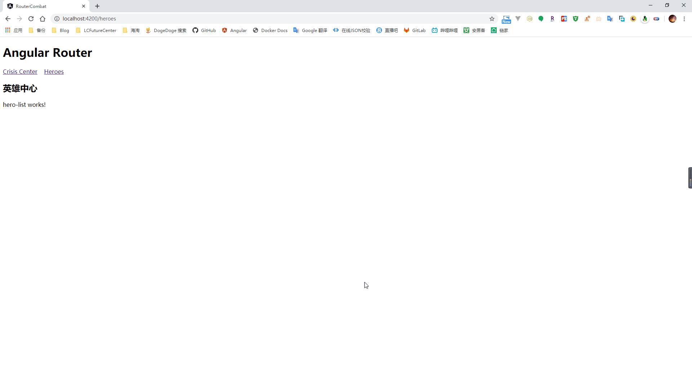
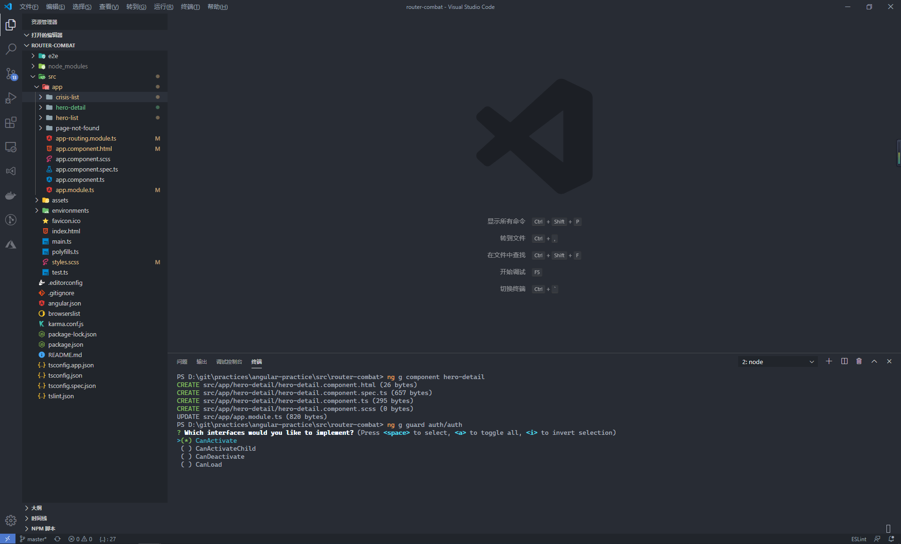
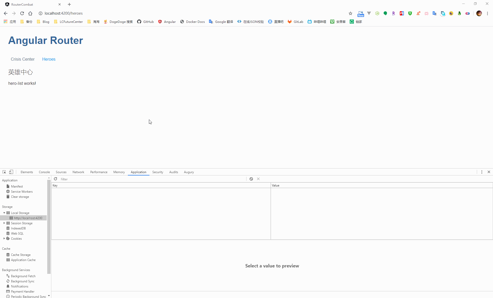
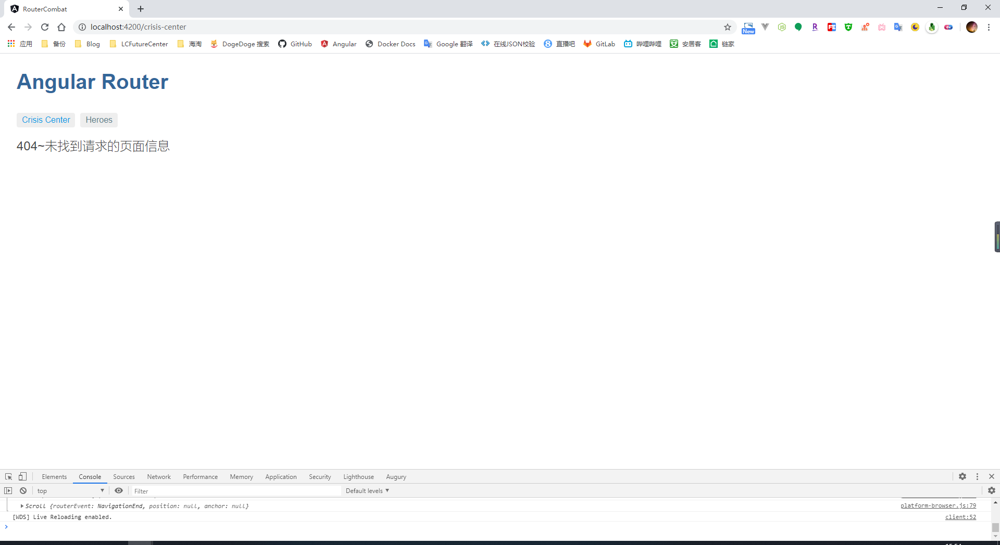
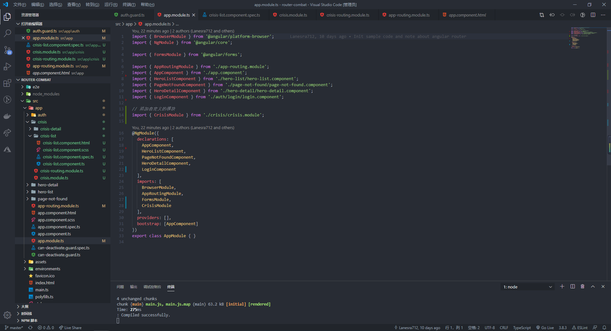

## Knowledge Graph


## Step by Step

### 1、基础准备

重复上一篇笔记的内容，搭建一个包含路由配置的 Angualr 项目

新建四个组件，分别对应于三个实际使用到的页面与一个设置为通配路由的 404 页面

```powershell
-- 危机中心页面
ng g component crisis-list

-- 英雄中心页面
ng g component hero-list

-- 英雄相亲页面
ng g component hero-detail

-- 404 页面
ng g component page-not-found 
```

在 app-routing.module.ts 文件中完成对于项目路由的定义，这里包含了对于路由的重定向、通配路由，以及通过动态路由进行参数传递的使用

```typescript
import { NgModule } from '@angular/core';
import { Routes, RouterModule } from '@angular/router';

// 引入组件
import { CrisisListComponent } from './crisis-list/crisis-list.component';
import { HeroListComponent } from './hero-list/hero-list.component';
import { HeroDetailComponent } from './hero-detail/hero-detail.component';
import { PageNotFoundComponent } from './page-not-found/page-not-found.component';

const routes: Routes = [
  {
    path: 'crisis-center',
    component: CrisisListComponent,
  },
  {
    path: 'heroes',
    component: HeroListComponent,
  },
  {
    path: 'hero/:id',
    component: HeroDetailComponent,
  },
  {
    path: '',
    redirectTo: '/heroes',
    pathMatch: 'full',
  },
  {
    path: '**',
    component: PageNotFoundComponent,
  }
];

@NgModule({
  imports: [RouterModule.forRoot(routes)],
  exports: [RouterModule],
})
export class AppRoutingModule { }
```

之后，在根组件中，添加 router-outlet 标签用来声明路由在页面上渲染的出口

```html
<h1>Angular Router</h1>
<nav>
  <a routerLink="/crisis-center" routerLinkActive="active">Crisis Center</a> &nbsp;&nbsp;
  <a routerLink="/heroes" routerLinkActive="active">Heroes</a>
</nav>
<router-outlet></router-outlet>
```




### 2、路由守卫

在 Angular 中，路由守卫主要可以解决以下的问题

- 对于用户访问页面的权限校验（是否已经登录？已经登录的角色是否有权限进入？）
- 在跳转到组件前获取某些必须的数据
- 离开页面时，提示用户是否保存未提交的修改

Angular 路由模块提供了如下的几个接口用来帮助我们解决上面的问题

- CanActivate：用来处理系统跳转到到某个路由地址的操作（判断是否可以进行访问）
- CanActivateChild：功能同 CanActivate，只不过针对的是子路由
- CanDeactivate：用来处理从当前路由离开的情况（判断是否存在未提交的信息）
- CanLoad：是否允许通过延迟加载的方式加载某个模块 

在添加了路由守卫之后，通过路由守卫返回的值，从而达到我们控制路由的目的

- true：导航将会继续
- false：导航将会中断，用户停留在当前的页面或者是跳转到指定的页面
- UrlTree：取消当前的导航，并导航到路由守卫返回的这个 UrlTree 上（一个新的路由信息）

#### 2.1、CanActivate：认证授权

在实现路由守卫之前，可以通过 Angular CLI 来生成路由守卫的接口实现类，通过命令行，在 app/auth 路由下生成一个授权守卫类，CLI 会提示我们选择继承的路由守卫接口，这里选择 CanActivate 即可

```shell
ng g guard auth/auth
```



在 AuthGuard 这个路由守卫类中，我们模拟了是否允许访问一个路由地址的认证授权。首先判断是否已经登录，如果登录后再判断当前登录人是否具有当前路由地址的访问权限

```typescript
import { Injectable } from '@angular/core';
import { CanActivate, ActivatedRouteSnapshot, RouterStateSnapshot, UrlTree, Router } from '@angular/router';
import { Observable } from 'rxjs';

@Injectable({
  providedIn: 'root'
})
export class AuthGuard implements CanActivate {

  /**
   * ctor
   * @param router 路由
   */
  constructor(private router: Router) { }

  canActivate(
    next: ActivatedRouteSnapshot,
    state: RouterStateSnapshot): Observable<boolean | UrlTree> | Promise<boolean | UrlTree> | boolean | UrlTree {

    // 判断是否有 token 信息
    let token = localStorage.getItem('auth-token') || '';
    if (token === '') {
      this.router.navigate(['/login']);
      return false;
    }

    // 判断是否可以访问当前连接
    let url: string = state.url;
    if (token === 'admin' && url === '/crisis-center') {
      return true;
    }

    this.router.navigate(['/login']);
    return false;
  }
}
```

之后我们就可以在 app-routing.module.ts 文件中引入 AuthGuard 类，针对需要保护的路由进行配置

```typescript
import { NgModule } from '@angular/core';
import { Routes, RouterModule } from '@angular/router';

// 引入组件
import { CrisisListComponent } from './crisis-list/crisis-list.component';

// 引入路由守卫
import { AuthGuard } from './auth/auth.guard';

const routes: Routes = [
  {
    path: 'crisis-center',
    component: CrisisListComponent,
    canActivate: [AuthGuard], // 添加针对当前路由的 canActivate 路由守卫
  }
];

@NgModule({
  imports: [RouterModule.forRoot(routes)],
  exports: [RouterModule],
})
export class AppRoutingModule { }
```



#### 2.2、CanActivateChild：针对子路由的认证授权

与继承 CanActivate 接口进行路由守卫的方式相似，针对子路由的认证授权可以通过继承  CanActivateChild 接口来实现，因为授权的逻辑很相似，这里通过多重继承的方式，扩展 AuthGuard 的功能，从而达到同时针对路由和子路由的路由守卫

改造下原先 canActivate 方法的实现，判断用户的 token 信息中包含 admin 即可访问 crisis-center 页面，在针对子路由进行认证授权的 canActivateChild 方法中，通过判断 token 信息是否为 admin-master 模拟对于子路由的认证

```typescript
import { Injectable } from '@angular/core';
import { CanActivate, ActivatedRouteSnapshot, RouterStateSnapshot, UrlTree, Router, CanActivateChild } from '@angular/router';
import { Observable } from 'rxjs';

@Injectable({
  providedIn: 'root'
})
export class AuthGuard implements CanActivate, CanActivateChild {

  /**
   * ctor
   * @param router 路由
   */
  constructor(private router: Router) { }

  canActivate(
    next: ActivatedRouteSnapshot,
    state: RouterStateSnapshot): Observable<boolean | UrlTree> | Promise<boolean | UrlTree> | boolean | UrlTree {

    // 判断是否有 token 信息
    let token = localStorage.getItem('auth-token') || '';
    if (token === '') {
      this.router.navigate(['/login']);
      return false;
    }

    // 判断是否可以访问当前连接
    let url: string = state.url;
    if (token.indexOf('admin') !== -1 && url.indexOf('/crisis-center') !== -1) {
      return true;
    }

    this.router.navigate(['/login']);
    return false;
  }

  canActivateChild(
    childRoute: ActivatedRouteSnapshot,
    state: RouterStateSnapshot): boolean | UrlTree | Observable<boolean | UrlTree> | Promise<boolean | UrlTree> {
    let token = localStorage.getItem('auth-token') || '';
    if (token === '') {
      this.router.navigate(['/login']);
      return false;
    }

    return token === 'admin-master';
  }
}
```

通过 Angular CLI 新增一个 crisis-detail 组件，作为 crisis-list 的子组件

```shell
ng g component crisis-detail
```

接下来在 crisis-list 中添加 router-outlet 标签，用来定义子路由的渲染出口

```html
<h2>危机中心</h2>

<ul class="crises">
  <li *ngFor="let crisis of crisisList">
    <a [routerLink]="[crisis.id]">
      <span class="badge">{{ crisis.id }}</span>{{ crisis.name }}
    </a>
  </li>
</ul>

<!-- 定义子路由的渲染出口 -->
<router-outlet></router-outlet>
```

在针对子路由的认证授权配置时，我们可以选择针对每个子路由添加 canActivateChild 属性，也可以定义一个空地址的子路由，将所有归属于 crisis-list 的子路由作为这个空路由的子路由，通过针对这个空路径添加 canActivateChild 属性，从而实现将守护规则应用到所有的子路由上

这里其实相当于将原先两级的路由模式（父：crisis-list，子：crisis-detail）改成了三级（父：crisis-list，子：' '（空路径），孙：crisis-detail）

```typescript
import { NgModule } from '@angular/core';
import { Routes, RouterModule } from '@angular/router';

// 引入组件
import { CrisisListComponent } from './crisis-list/crisis-list.component';
import { CrisisDetailComponent } from './crisis-detail/crisis-detail.component';

// 引入路由守卫
import { AuthGuard } from './auth/auth.guard';

const routes: Routes = [
  {
    path: 'crisis-center',
    component: CrisisListComponent,
    canActivate: [AuthGuard], // 添加针对当前路由的 canActivate 路由守卫
    children: [{
      path: '',
      canActivateChild: [AuthGuard], // 添加针对子路由的 canActivate 路由守卫
      children: [{
        path: 'detail',
        component: CrisisDetailComponent
      }]
    }]
  }
];

@NgModule({
  imports: [RouterModule.forRoot(routes)],
  exports: [RouterModule],
})
export class AppRoutingModule { }
```


#### 2.3、CanDeactivate：处理用户未提交的修改

当进行表单填报之类的操作时，因为会涉及到一个提交的动作，当用户没有点击保存按钮就离开时，最好能暂停，对用户进行一个友好性的提示，由用户选择后续的操作

创建一个路由守卫，继承于 CanDeactivate 接口

```shell
ng g guard hero-list/guards/hero-can-deactivate
```

与上面的 CanActivate、CanActivateChild 路由守卫的使用方式不同，对于 CanDeactivate 守卫来说，我们需要将参数中的 unknown 替换成我们实际需要进行路由守卫的组件

```typescript
import { Injectable } from '@angular/core';
import { CanDeactivate, ActivatedRouteSnapshot, RouterStateSnapshot, UrlTree } from '@angular/router';
import { Observable } from 'rxjs';

@Injectable({
  providedIn: 'root'
})
export class HeroCanDeactivateGuard implements CanDeactivate<unknown> {
  canDeactivate(
    component: unknown,
    currentRoute: ActivatedRouteSnapshot,
    currentState: RouterStateSnapshot,
    nextState?: RouterStateSnapshot): Observable<boolean | UrlTree> | Promise<boolean | UrlTree> | boolean | UrlTree {
    return true;
  }
  
}
```

例如，这里针对的是 HeroListComponent 这个组件，因此我们需要将泛型的参数 unknown 改为 HeroListComponent，通过 component 参数，就可以获得需要进行路由守卫的组件的相关信息

```typescript
import { Injectable } from '@angular/core';
import {
  CanDeactivate,
  ActivatedRouteSnapshot,
  RouterStateSnapshot,
  UrlTree,
} from '@angular/router';
import { Observable } from 'rxjs';

// 引入需要进行路由守卫的组件
import { HeroListComponent } from '../hero-list.component';

@Injectable({
  providedIn: 'root',
})
export class HeroCanDeactivateGuard
  implements CanDeactivate<HeroListComponent> {
  canDeactivate(
    component: HeroListComponent,
    currentRoute: ActivatedRouteSnapshot,
    currentState: RouterStateSnapshot,
    nextState?: RouterStateSnapshot
  ):
    | Observable<boolean | UrlTree>
    | Promise<boolean | UrlTree>
    | boolean
    | UrlTree {

    // 判断是否修改了原始数据
    //
    const data = component.hero;
    if (data === undefined) {
      return true;
    }
    const origin = component.heroList.find(hero => hero.id === data.id);
    if (data.name === origin.name) {
      return true;
    }

    return window.confirm('内容未提交，确认离开？');
  }
}
```

这里模拟判断用户有没有修改原始的数据，当用户修改了数据并移动到别的页面时，触发路由守卫，提示用户是否保存后再离开当前页面


### 3、异步路由

#### 3.1、惰性加载

当应用逐渐扩大，使用现有的路由加载方式会造成应用在第一次访问时就加载了全部的组件，从而导致系统首次渲染过慢。因此可以使用惰性加载的方式在请求具体的模块时才加载对应的组件

惰性加载只针对于模块（NgModule），因此为了使用惰性加载这个特性，我们需要将系统按照功能划分，拆分出一个个独立的模块

首先通过 Angular CLI 创建一个危机中心模块（crisis 模块）

```powershell
-- 查看创建模块的相关参数
ng g module --help

-- 创建危机中心模块（自动在 app.moudule.ts 中引入新创建的 CrisisModule、添加当前模块的路由配置）
ng g module crisis --module app --routing
```

将 crisis-list、crisis-detail 组件全部移动到 crisis 模块下面，并在 CrisisModule 中添加对于 crisis-list、crisis-detail 组件的声明，同时将原来在 app.module.ts 中声明的组件代码移除

```typescript
import { NgModule } from '@angular/core';
import { CommonModule } from '@angular/common';

import { CrisisRoutingModule } from './crisis-routing.module';

import { FormsModule } from '@angular/forms';

// 引入模块中使用到的组件
import { CrisisListComponent } from './crisis-list/crisis-list.component';
import { CrisisDetailComponent } from './crisis-detail/crisis-detail.component';


@NgModule({
  declarations: [
    CrisisListComponent,
    CrisisDetailComponent
  ],
  imports: [
    CommonModule,
    FormsModule,
    CrisisRoutingModule
  ]
})
export class CrisisModule { }
```

同样的，将当前模块的路由配置移动到专门的路由配置文件 crisis-routing.module.ts 中，并将 app-routing.module.ts 中相关的路由配置删除

```typescript
import { NgModule } from '@angular/core';
import { Routes, RouterModule } from '@angular/router';

// 引入组件
import { CrisisListComponent } from './crisis-list/crisis-list.component';
import { CrisisDetailComponent } from './crisis-detail/crisis-detail.component';

// 引入路由守卫
import { AuthGuard } from '../auth/auth.guard';

const routes: Routes = [{
  path: '',
  component: CrisisListComponent,
  canActivate: [AuthGuard], // 添加针对当前路由的 canActivate 路由守卫
  children: [{
    path: '',
    canActivateChild: [AuthGuard], // 添加针对子路由的 canActivate 路由守卫
    children: [{
      path: 'detail',
      component: CrisisDetailComponent
    }]
  }]
}];

@NgModule({
  imports: [RouterModule.forChild(routes)],
  exports: [RouterModule]
})
export class CrisisRoutingModule { }
```

 重新运行项目，如果你在创建模块的命令中设置了自动引入当前模块到 app.module.ts 文件中，大概率会遇到下面的问题



这里的问题与配置通配路由需要放到最后的原因相似，因为脚手架在帮我们将创建的模块导入到 app.module.ts 中时，是添加到整个数组的最后的，同时因为我们已经将 crisis 模块的路由配置移动到专门的 crisis-routing.module.ts 中了，因此框架在路由匹配时已经匹配上 app-routing.module.ts 中设置的通配路由了，从而导致无法找到实际应该对应的组件，因此这里我们需要将 AppRoutingModule 放到声明的最后



当模块创建完成后，就可以针对 crisis 模块设置惰性加载

在配置惰性路由时，我们需要以一种类似于子路由的方式进行配置，通过路由的 loadChildren 属性来加载对应的模块，而不是具体的组件，修改后的 app-routing.module.ts 代码如下

```typescript
import { HeroCanDeactivateGuard } from './hero-list/guards/hero-can-deactivate.guard';
import { NgModule } from '@angular/core';
import { Routes, RouterModule } from '@angular/router';

const routes: Routes = [
  {
    path: 'crisis-center',
    loadChildren: () => import('./crisis/crisis.module').then(m => m.CrisisModule)
  }
];

@NgModule({
  imports: [RouterModule.forRoot(routes, { enableTracing: true })],
  exports: [RouterModule],
})
export class AppRoutingModule { }
```

当导航到这个 /crisis-center 路由时，框架会通过 loadChildren 字符串来动态加载 CrisisModule，然后把 CrisisModule 添加到当前的路由配置中，而惰性加载和重新配置工作只会发生一次，也就是在该路由首次被请求时执行，在后续请求时，该模块和路由都是立即可用的

#### 3.2、CanLoad：杜绝未通过认证授权的组件加载

在上面的代码中，对于 CrisisModule 模块我们已经使用 CanActivate、CanActivateChild 路由守卫来进行路由的认证授权，但是当我们并没有权限访问该路由的权限，却依然点击了链接时，此时框架路由仍会加载该模块。为了杜绝这种授权未通过仍加载模块的问题发生，这里需要使用到 CanLoad 守卫

因为这里的判断逻辑与认证授权的逻辑相同，因此在 AuthGuard 中，继承 CanLoad 接口即可，修改后的 AuthGuard 代码如下

```typescript
import { Injectable } from '@angular/core';
import {
  CanActivate, ActivatedRouteSnapshot, RouterStateSnapshot, UrlTree, Router, CanActivateChild, CanLoad, Route, UrlSegment
} from '@angular/router';
import { Observable } from 'rxjs';

@Injectable({
  providedIn: 'root'
})
export class AuthGuard implements CanActivate, CanActivateChild, CanLoad {

  /**
   * ctor
   * @param router 路由
   */
  constructor(private router: Router) { }


  canActivate(
    next: ActivatedRouteSnapshot,
    state: RouterStateSnapshot): Observable<boolean | UrlTree> | Promise<boolean | UrlTree> | boolean | UrlTree {

    // 判断是否有 token 信息
    let token = localStorage.getItem('auth-token') || '';
    if (token === '') {
      this.router.navigate(['/login']);
      return false;
    }

    // 判断是否可以访问当前连接
    let url: string = state.url;
    if (token.indexOf('admin') !== -1 && url.indexOf('/crisis-center') !== -1) {
      return true;
    }

    this.router.navigate(['/login']);
    return false;
  }

  canActivateChild(
    childRoute: ActivatedRouteSnapshot,
    state: RouterStateSnapshot): boolean | UrlTree | Observable<boolean | UrlTree> | Promise<boolean | UrlTree> {
    let token = localStorage.getItem('auth-token') || '';
    if (token === '') {
      this.router.navigate(['/login']);
      return false;
    }

    return token === 'admin-master';
  }

  canLoad(route: Route, segments: UrlSegment[]): boolean | Observable<boolean> | Promise<boolean> {
    let token = localStorage.getItem('auth-token') || '';
    if (token === '') {
      this.router.navigate(['/login']);
      return false;
    }

    let url = `/${route.path}`;

    if (token.indexOf('admin') !== -1 && url.indexOf('/crisis-center') !== -1) {
      return true;
    }
  }
}
```

同样的，针对路由守卫的实现完成后，将需要使用到的路由守卫添加到 crisis-center 路由的 canLoad 数组中即可

```typescript
import { HeroCanDeactivateGuard } from './hero-list/guards/hero-can-deactivate.guard';
import { NgModule } from '@angular/core';
import { Routes, RouterModule } from '@angular/router';

const routes: Routes = [
  {
    path: 'crisis-center',
    loadChildren: () => import('./crisis/crisis.module').then(m => m.CrisisModule)
  }
];

@NgModule({
  imports: [RouterModule.forRoot(routes, { enableTracing: true })],
  exports: [RouterModule],
})
export class AppRoutingModule { }
```
